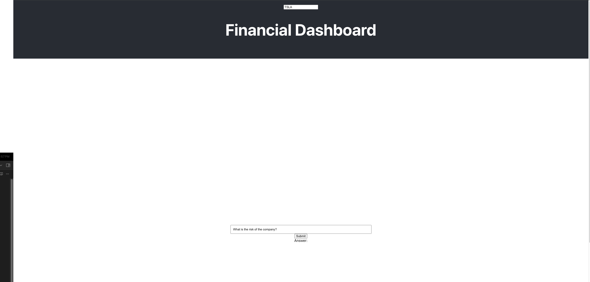

# Docker

[Download Docker Hub](https://www.docker.com/products/docker-desktop/)

[Download Dockerfile](https://drive.google.com/file/d/11UCE0hko8_6lyqRJG5C-Tv03_0wJCilf/view?usp=sharing)

Put dockerfile in the fintech file and run

```
docker load -i fsi_task_dockerfile.tar
```

# Backend 

in the backend folder run

```
flask --app app run
```

# Fronend

```
npm start
```



I used React for the fronend and flask for the backend for lite depolyment. ChatGPT for the text analysis.

Beacuse the 10-K fill is too large and exceed the limit of token of chatgpt-api. I used embedding to reduce the lenth of tokens.